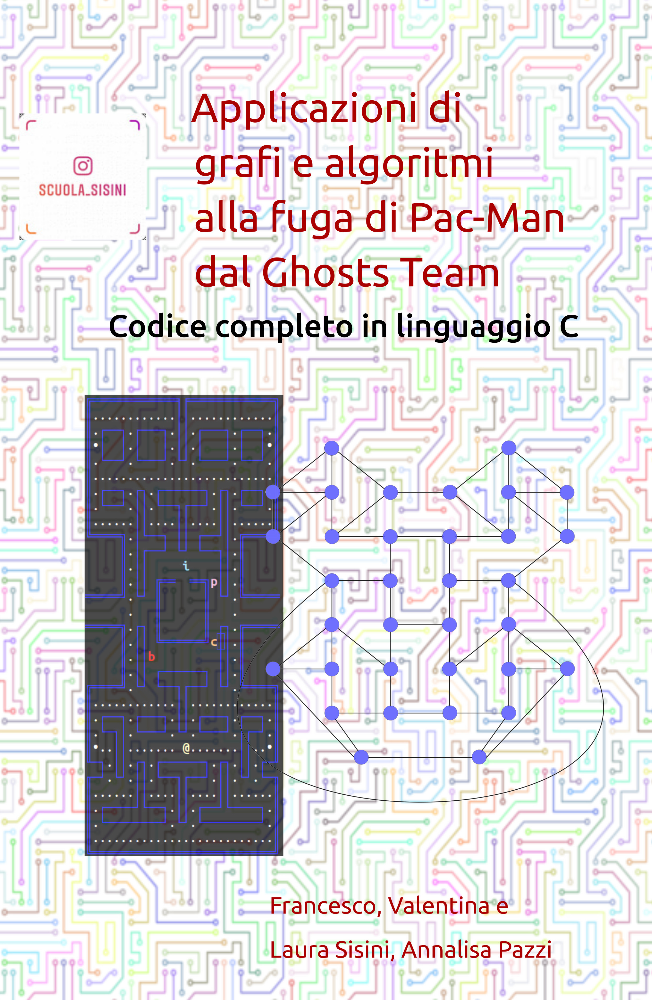

# Mangia e Fuggi
(ovvero, i miracolosi schemi di Pac-Man per complerare il lebirinto senza essere catturato dal Ghost-Team)

**New** Dal 4 settmbre il libro su Amazon [Applicazioni di grafi e algoritmi alla fuga di Pac-Man dal Ghosts Team](https://www.amazon.it/Applicazioni-grafi-algoritmi-Pac-Man-Ghosts-ebook/dp/B087GLBPNM/)

## Il labirinto di Pac-Man su una piattaforma Open Source
La piattaforma [Tuki-5](mvc) è una implementazione parziale del gioco del Pac-Man in linguaggio C.
Sfruttando la piattaforma si possono sviluppare specifci *agents* per studiare le strategie di *attacco* e di *difesa* nel gioco

### Pac-Man vaga per il labirinto
Questo *agent* percorre tutto il labirinto sfidando i fantasmi, ma se vince è solo... una questione di fortuna!

Prova il [codice](PacMan/gioca_tuki_random.c)

### Pac-Man segue il filo di Arianna
La logica implementata da questo *agent* è quella del boustrohpedon, un algoritmo di path-covering

Prova il [codice](PacMan/gioca_tuki_boustrophedon.c)

### Pac-Man si crea un grafo del labirinto
La teoria dei grafi offre una base formale per sviluppare algoritmi di path search e exploring. Questo *agent* mentre vaga per il labirinto crea *mentalmente* un grafo dove gli incroci rappresentano i **vertici** e i corridoi sono gli **archi**

Prova il [codice](PacMan/gioca_tuki_generagrafo.c)

<!--[Applicazioni di grafi e algoritmi alla fuga di Pac-Man dal Ghosts Team](https://www.amazon.it/Applicazioni-grafi-algoritmi-Pac-Man-Ghosts-ebook/dp/B087GLBPNM/)
-->
